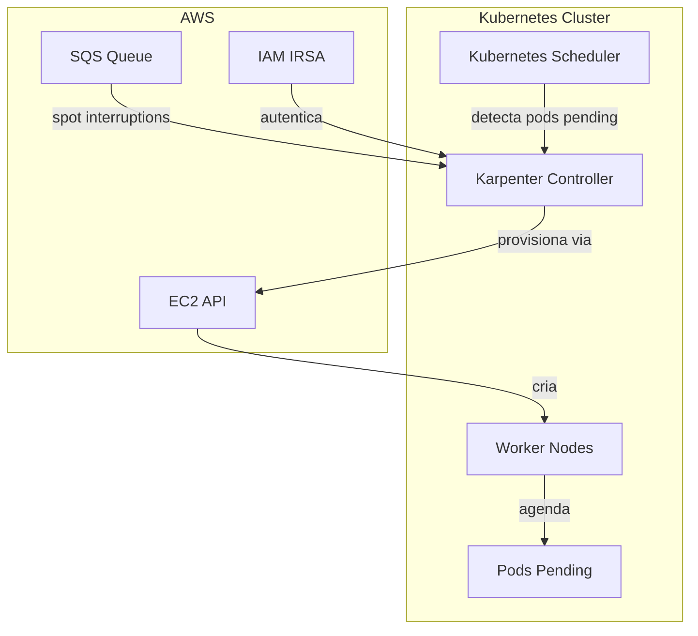
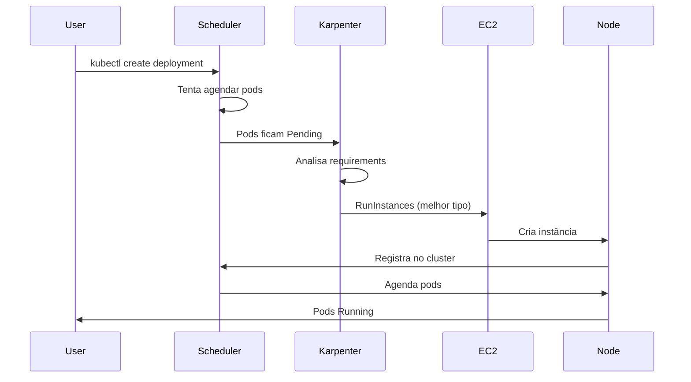
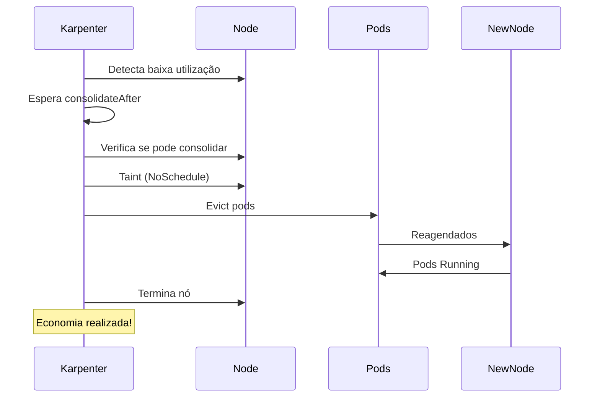
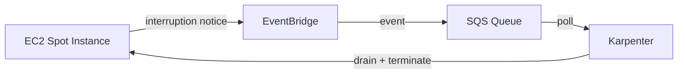
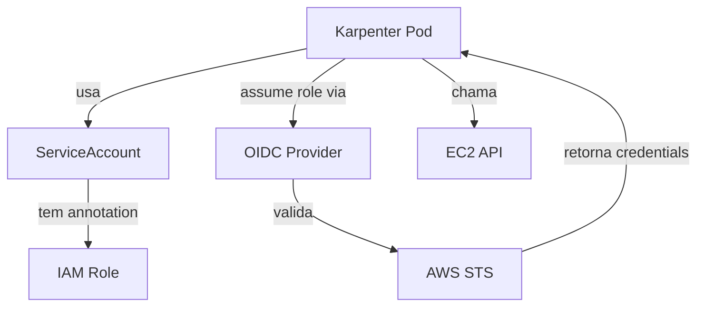
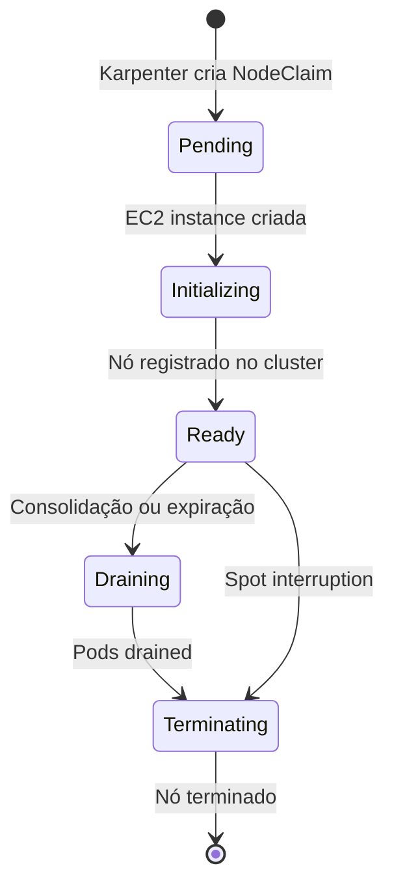

# Arquitetura do Karpenter

## Visão Geral

O Karpenter opera como um controller dentro do cluster Kubernetes, monitorando pods pending e provisionando nós de forma inteligente e rápida.

## Componentes Principais



## Fluxo de Provisionamento



## Fluxo de Consolidação



## Componentes Detalhados

### 1. Karpenter Controller

**Responsabilidades:**
- Monitorar pods Pending
- Analisar requirements e constraints
- Selecionar melhor instance type
- Provisionar nós via EC2 API
- Consolidar nós subutilizados
- Reagir a interrupções Spot
- Expirar nós antigos

**Deployment:**
- Namespace: `karpenter`
- Replicas: 1 (dev) ou 2+ (prod)
- Resources: ~100m CPU, 256Mi Memory
- Roda em: Bootstrap node group (on-demand)

### 2. NodePool (CRD)

**Define:**
- **Quando** provisionar (requirements, limits)
- **Como** provisionar (nodeClassRef)
- **Disruption** policies (consolidação, expiração)
- **Prioridade** (weight)

**Exemplo:**

```yaml
apiVersion: karpenter.sh/v1
kind: NodePool
metadata:
  name: default
spec:
  template:
    spec:
      nodeClassRef:
        name: default
      requirements:
        - key: kubernetes.io/arch
          values: ["arm64"]
  limits:
    cpu: "100"
  disruption:
    consolidationPolicy: WhenUnderutilized
```

### 3. EC2NodeClass (CRD)

**Define:**
- **O que** provisionar (AMI, instance config)
- **Onde** provisionar (subnets, security groups)
- **Como** configurar (user data, volumes, IAM)

**Exemplo:**

```yaml
apiVersion: karpenter.k8s.aws/v1
kind: EC2NodeClass
metadata:
  name: default
spec:
  amiFamily: AL2023
  subnetSelectorTerms:
    - tags:
        karpenter.sh/discovery: my-cluster
  role: KarpenterNodeRole
```

### 4. NodeClaim (CRD)

**Representa:**
- Nó sendo provisionado ou existente
- Criado automaticamente pelo Karpenter
- Lifecycle: Pending → Ready → Terminating

**Comandos:**

```bash
# Ver NodeClaims
kubectl get nodeclaims

# Detalhar
kubectl describe nodeclaim <name>
```

## Bootstrap Pattern

### Por que Bootstrap Node Group?

**Problema:** Chicken-and-egg

```
Se Karpenter roda em nós que ele gerencia:
1. Karpenter consolida nó onde ele está
2. Karpenter é evicted
3. Karpenter não pode provisionar novo nó (não está rodando!)
4. Cluster fica sem autoscaling
```

**Solução:** Bootstrap node group separado

```
Bootstrap Node Group (On-Demand):
├─ Karpenter controller ✅
├─ CoreDNS ✅
├─ VPC-CNI ✅
└─ Monitoring ✅

Karpenter Nodes (Spot):
├─ Aplicações
├─ Batch jobs
└─ Workloads normais
```

### Configuração do Bootstrap

```hcl
resource "aws_eks_node_group" "bootstrap" {
  cluster_name = aws_eks_cluster.main.name
  node_group_name = "bootstrap"
  
  instance_types = ["t4g.medium"]
  capacity_type  = "ON_DEMAND"  # Não usar Spot!
  
  scaling_config {
    min_size     = 2  # HA
    max_size     = 3
    desired_size = 2
  }
  
  # Taint para evitar workloads normais
  taint {
    key    = "CriticalAddonsOnly"
    value  = "true"
    effect = "NO_SCHEDULE"
  }
}
```

**Karpenter tolera o taint:**

```yaml
# Helm values
tolerations:
  - key: CriticalAddonsOnly
    operator: Exists
    effect: NoSchedule
```

## Interruption Handling

### Arquitetura



### Fluxo Detalhado

```
1. AWS anuncia interrupção Spot (2 min antes)
2. EventBridge captura evento
3. SQS Queue recebe mensagem
4. Karpenter poll SQS (a cada 5s)
5. Karpenter lê mensagem
6. Karpenter taint nó (NoSchedule)
7. Karpenter drain pods (graceful)
8. Karpenter provisiona novo nó (se necessário)
9. Scheduler reagenda pods
10. Nó é terminado pela AWS
```

### Componentes

**SQS Queue:**
- Nome: `Karpenter-<cluster-name>`
- Retention: 5 minutos
- Visibility timeout: 60 segundos

**EventBridge Rules:**
- Spot Instance Interruption Warning
- Spot Instance Rebalance Recommendation
- EC2 Instance State-change Notification

**Terraform (criado automaticamente):**

```hcl
module "karpenter" {
  enable_spot_termination = true  # ← Cria SQS + EventBridge
}
```

## IAM Architecture

### IRSA (IAM Roles for Service Accounts)



### Trust Relationship

```
1. Pod tem ServiceAccount com annotation
2. Pod faz request para OIDC provider
3. OIDC provider valida pod identity
4. STS emite temporary credentials
5. Pod usa credentials para chamar AWS APIs
```

**Benefícios:**
- ✅ Sem credenciais estáticas
- ✅ Credentials rotacionadas automaticamente
- ✅ Scoped permissions por ServiceAccount
- ✅ Auditável via CloudTrail

## Descoberta de Recursos

### Tags

Karpenter descobre subnets e security groups via **tags**:

```
Key: karpenter.sh/discovery
Value: <cluster-name>
```

### Seleção de Subnets

```yaml
subnetSelectorTerms:
  - tags:
      karpenter.sh/discovery: my-cluster
  # Karpenter seleciona TODAS as subnets com essa tag
```

### Seleção de Security Groups

```yaml
securityGroupSelectorTerms:
  - tags:
      karpenter.sh/discovery: my-cluster
  # Karpenter usa TODOS os security groups com essa tag
```

## Scheduling Flow

### 1. Pod é criado

```yaml
kubectl create deployment nginx --image=nginx --replicas=10
```

### 2. Scheduler tenta agendar

```
Scheduler verifica:
├─ Resource requests do pod
├─ Node selectors
├─ Affinities
├─ Tolerations
└─ Topology constraints

Resultado: Nenhum nó disponível → Pod fica Pending
```

### 3. Karpenter detecta

```
Karpenter vê:
├─ Pod Pending
├─ Requirements: cpu=100m, memory=128Mi
├─ NodeSelector: arch=arm64
└─ Toleration: none

Karpenter decide: Provisionar t4g.medium ARM64 Spot
```

### 4. Nó é provisionado

```
EC2 API:
├─ Cria instância t4g.medium
├─ Aplica user data (join cluster)
├─ Registra no EKS
└─ Nó fica Ready

Tempo total: ~60 segundos
```

### 5. Pod é agendado

```
Scheduler:
├─ Detecta novo nó
├─ Verifica constraints
├─ Agenda pod no nó
└─ Pod fica Running

Tempo: ~5 segundos
```

## Consolidation Flow

### Detecção de Oportunidade

```
Karpenter monitora:
├─ Utilização de cada nó (via requests)
├─ Possibilidade de mover pods
├─ PodDisruptionBudgets
└─ Disruption budget

Se utilização < 50% E pods podem ser movidos:
→ Considera consolidação
```

### Decisão

```
Karpenter calcula:
├─ Quantos nós podem ser removidos?
├─ Pods podem ser movidos para onde?
├─ Vale a pena economicamente?
└─ Respeita PDBs e budgets?

Se SIM → Inicia consolidação
```

### Execução

```
1. Taint nó (NoSchedule)
2. Drain pods (eviction)
3. Aguarda pods serem reagendados
4. Termina nó
5. Economia realizada!
```

## Drift Detection

Karpenter detecta quando nós estão **desatualizados** (drift):

```
Drift ocorre quando:
├─ EC2NodeClass é atualizado (nova AMI)
├─ NodePool requirements mudam
└─ User data é modificado

Karpenter:
├─ Detecta drift
├─ Marca nó para substituição
├─ Provisiona novo nó
├─ Drain nó antigo
└─ Termina nó antigo
```

## Scaling Decisions

### Bin-Packing

Karpenter usa **bin-packing** para otimizar custos:

```
Pods Pending:
├─ Pod A: 500m CPU, 1GB RAM
├─ Pod B: 200m CPU, 512MB RAM
└─ Pod C: 100m CPU, 256MB RAM

Karpenter calcula:
Opção 1: 3x t4g.small (2 vCPU cada) = $0.0168/h
Opção 2: 1x t4g.medium (2 vCPU) = $0.0336/h

Karpenter escolhe: Opção 2 (1 nó maior é mais barato!)
```

### Instance Type Selection

```
1. Filtra instance types que atendem requirements
2. Calcula fit para os pods pending
3. Considera preço (Spot price-capacity-optimized)
4. Escolhe o mais barato que atende
```

## Componentes AWS

### SQS Queue

**Propósito:** Receber eventos de interrupção Spot

**Configuração:**
- Retention: 5 minutos
- Visibility timeout: 60 segundos
- Encryption: Habilitada

### EventBridge Rules

**Eventos capturados:**
1. `EC2 Spot Instance Interruption Warning`
2. `EC2 Instance Rebalance Recommendation`
3. `EC2 Instance State-change Notification`

### IAM Roles

**Karpenter Controller Role:**
- Provisionar/terminar instâncias
- Ler pricing data
- Receber mensagens SQS

**Node Role:**
- Registrar no EKS
- Pull images do ECR
- Acessar CNI

## High-Level Architecture

```
┌─────────────────────────────────────────────────────┐
│ EKS Control Plane                                   │
│ - API Server                                        │
│ - Scheduler (detecta Pending)                       │
└────────────────────┬────────────────────────────────┘
                     │
    ┌────────────────┼────────────────┐
    │                │                │
    ▼                ▼                ▼
┌─────────┐    ┌──────────┐    ┌──────────┐
│Bootstrap│    │Karpenter │    │Karpenter │
│  Nodes  │    │  Node 1  │    │  Node 2  │
│         │    │          │    │          │
│Karpenter│    │Workloads │    │Workloads │
│CoreDNS  │    │          │    │          │
│VPC-CNI  │    │          │    │          │
└─────────┘    └──────────┘    └──────────┘
  On-Demand       Spot            Spot
  Multi-AZ        ARM64           ARM64
```

## CRDs (Custom Resource Definitions)

### NodePool

```yaml
apiVersion: karpenter.sh/v1
kind: NodePool
```

**Propósito:** Define políticas de provisionamento

**Campos principais:**
- `spec.template.spec.requirements` - Constraints
- `spec.limits` - Limites de recursos
- `spec.disruption` - Políticas de consolidação
- `spec.weight` - Prioridade

### EC2NodeClass

```yaml
apiVersion: karpenter.k8s.aws/v1
kind: EC2NodeClass
```

**Propósito:** Define configuração EC2

**Campos principais:**
- `spec.amiFamily` - Família de AMI
- `spec.subnetSelectorTerms` - Seleção de subnets
- `spec.securityGroupSelectorTerms` - Security groups
- `spec.role` - IAM role dos nós
- `spec.blockDeviceMappings` - Configuração de disco

### NodeClaim

```yaml
apiVersion: karpenter.sh/v1
kind: NodeClaim
```

**Propósito:** Representa um nó específico

**Lifecycle:**
1. **Pending**: Sendo provisionado
2. **Ready**: Disponível para pods
3. **Terminating**: Sendo removido

**Criado automaticamente** pelo Karpenter (não criar manualmente).

## Interação com Kubernetes

### Scheduler

```
Kubernetes Scheduler:
├─ Agenda pods em nós existentes
├─ Se não houver nó disponível → Pod fica Pending
└─ Karpenter detecta e provisiona novo nó

Karpenter NÃO substitui o Scheduler!
Karpenter provisiona nós, Scheduler agenda pods.
```

### Taints e Tolerations

```
Karpenter pode adicionar taints:
├─ Durante consolidação (NoSchedule)
├─ Durante drift (NoSchedule)
└─ Configurados no NodePool

Pods precisam tolerar taints para serem agendados.
```

### Labels

```
Karpenter adiciona labels automaticamente:
├─ node.kubernetes.io/instance-type
├─ topology.kubernetes.io/zone
├─ karpenter.sh/capacity-type
├─ karpenter.sh/nodepool
└─ kubernetes.io/arch
```

## Ciclo de Vida do Nó



## Performance

### Tempo de Provisionamento

```
Karpenter detecta Pending: ~5s
EC2 API provisiona: ~45-60s
Nó registra no cluster: ~10-15s
Pod é agendado: ~5s

Total: ~60-90 segundos
```

### Comparação

| Autoscaler | Tempo Médio |
|------------|-------------|
| Karpenter | ~1 minuto |
| Cluster Autoscaler | ~3-5 minutos |
| Manual | ~10+ minutos |

## Escalabilidade

### Limits

- **Nós por NodePool**: Ilimitado (definido por `spec.limits`)
- **NodePools por cluster**: Ilimitado (recomendado < 10)
- **Pods por nó**: Depende do instance type (max 110 no EKS)

### Performance em Escala

Karpenter testado com:
- ✅ 1000+ nós
- ✅ 10,000+ pods
- ✅ 100+ NodePools

## Referências

- [Karpenter Concepts](https://karpenter.sh/docs/concepts/)
- [EKS Architecture](https://docs.aws.amazon.com/eks/latest/userguide/eks-architecture.html)
- [Kubernetes Scheduling](https://kubernetes.io/docs/concepts/scheduling-eviction/)
